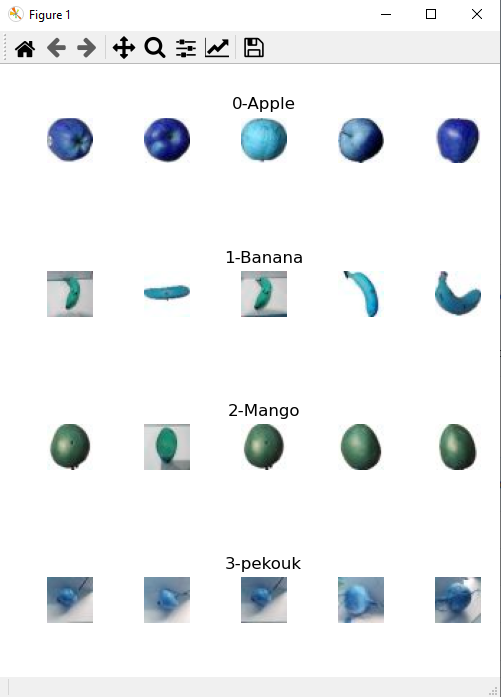
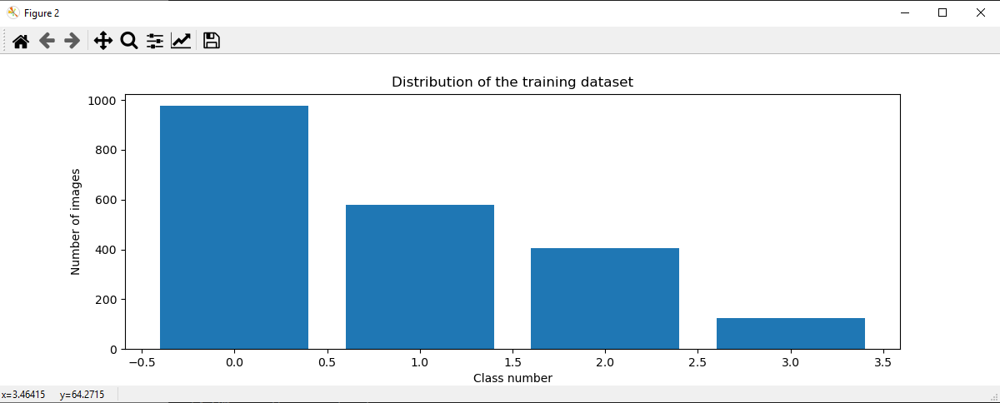
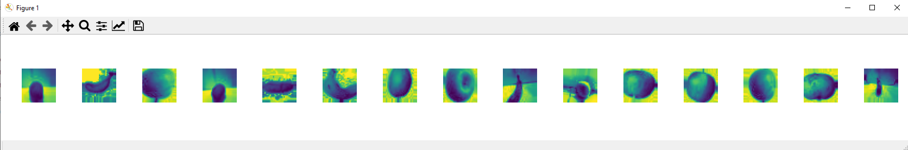
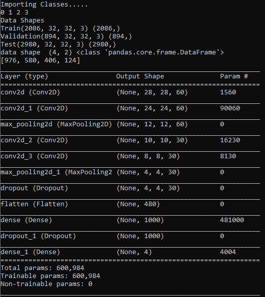
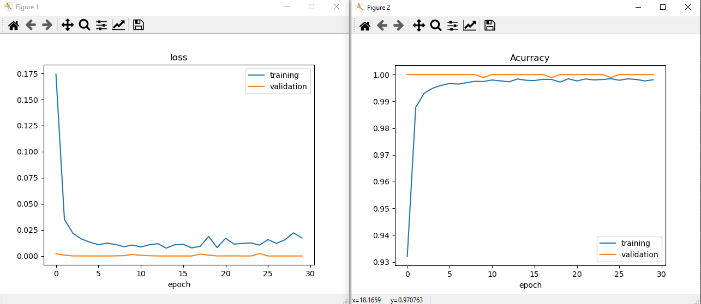

# Fruit-Recognition-Using-Tensorflow-Keras-
Python project for Fruit Recognition using Keras 
### Data Set
Data set for Fruit Recognition may be download from here https://drive.google.com/file/d/1_BE8He-6aA4qjgH_wEd3jTIMyKKyGr0I/view?usp=sharing
### Out put results 
### Fruit classes

### Distribution of the training data set

### Convert into GrayScale

### No. of classess, No. of Train, Val, Test images, Layers and parameters

### Acuracy and Loss 

